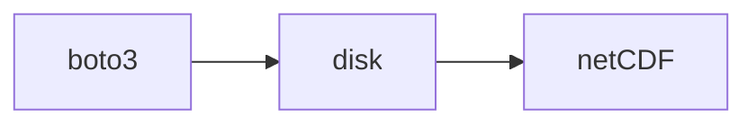
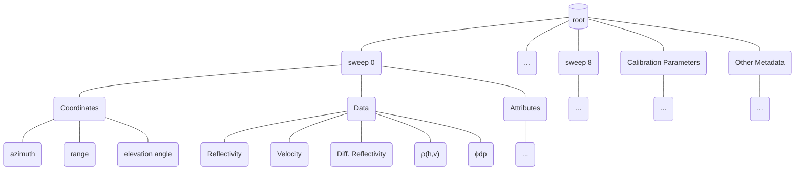

I'm writing this post (and any subsequent parts)
as a tutorial for my previous self, the one who
wanted to work with weather radar data but had no
actual idea how, and who struggled to pull together
the various pieces of information on the internet into a coherent
picture of how data actually gets processed into final products.
I'm also going to use it as an opportunity to explain my own work on
a practical processing pipeline for my own organization. This is
an expanded version of a conference talk I gave with some extension to other
topics, since I've got more than 20 minutes to discuss everything.

I'm going to start with the very basics: what I mean when I talk about weather radar,
the appeal of working with it, and the challenges. The goal is to build
a common understanding so that it's less overwhelming to crack open a Nexrad level II file and
understand how they are worked with in practice.

## Why Radar?

Weather radar is a _really_ useful tool if you're trying
to understand how much it rains in a certain area. Weather radar
lets you sample a 3-D cut of the atmosphere and understand how much
stuff is kicking around in it, at an absurdly high sampling rate. It effectively
gives you a window into what the atmosphere is doing for hundreds of square km every
5-8 minutes, with exceptional spatial resolution. This is a huge improvement over
the other common approach, which is to have a network of rain gauges across the area
you're trying to measure.

### Tipping Buckets

Rain gauges (the NOAA-approved and used ones anyway) use tipping buckets to measure
the volume of rain falling in a period. This approach gives you a highly accurate
estimate of precipitation for a _very_ specific point. Once you've got that estimate,
you have to make your own assumptions of how rainfall varies between those gauges.
If a rain event misses all the gauges in an area, you won't see it. In practice,
if you want to reasonably measure precipitation across a large area, you've got to
maintain multiple tipping bucket gauges. Since this is a direct, physical measurement,
these gauges are also subject to direct, physical interference. Part of my day job is
monitoring the data streams from these gauges, and they very frequently go out of
calibration or get things stuck in them, meaning that they don't respond to precipitation.
The only way to fix that is by sending someone out to clean and check it, which is a
time-consuming and fiddly process.

<a href="https://commons.wikimedia.org/wiki/File:Interior_tipping_bucket.JPG#/media/File:Interior_tipping_bucket.JPG">

### Radar

Weather radar towers are positioned at fixed intervals across the landscape
and scan the atmosphere in a circular pattern, listening to reflected EM
radiation in their preferred band to discern what is in the air around
the station. This isn't the only way that these systems can work; they are
sometimes put on moving platforms, may scan a cut of the sky from horizon to horizon,
or be mounted on an aircraft, for example. All of these different operating modes
introduce more complexity into identifying what you're actually working with
and how relevant different techniques are to your specific application; for our
purposes we're talking about fixed, atmospheric monitoring radar systems,
and in particular the WSR-88D (NEXRAD) system, which is a lot simpler
in terms of operating mode. Just know that this complexity bleeds into the
tools that we use to process weather radar and introduce complexity there as well. Because they use EM radiation to observe
the atmosphere, doppler weather radars can provide a granular estimate
of precipitation (and precipitation type) across wide areas with great 3D resolution.
It's also really fast; a 5-8 minute scan of the air from a WSR-88D platform can
generate 18 scans of the atmosphere, with millions of observations per scan. The cost
to this precision is added complexity; it is really pretty complicated to go from a raw
radar return to a useful precipitation estimate, or even an identification of
what is falling through the air in a given location. But that is the very basic
idea of how radar works. There are a large number of exceptional
educational materials online you can refer to if you want a better understanding
of the principles of radar observation, which I will not badly paraphrase here.

<p><a href="https://commons.wikimedia.org/wiki/File:NEXRAD_and_thunderstorm_in_New_Underwood,_South_Dakota,_2004_-_NOAA_Photo_Library_Wea01195.jpg#/media/File:NEXRAD_and_thunderstorm_in_New_Underwood,_South_Dakota,_2004_-_NOAA_Photo_Library_Wea01195.jpg"></a></p>

## Accessing Radar

Now that we've described some basics of the system,
we can start getting our hands dirty and work with actual
radar files. NOAA provides multiple processing levels of NEXRAD data
for public consumption. I typically work with nexrad level II, which
has had some processing applied but does not include derived quantities
that level 3 has; this is a tradeoff I made for my desired use characteristics;
the level 3 data is downsampled to a lower resolution grid and has lower
time resolution, so even though it's convenient (especially in a post-hoc sense)
it doesn't quite cut the mustard for me for spatiotemporal resolution in
my day job.

### Nexrad Level II

The nexrad level II dataset
is [hosted on AWS](https://registry.opendata.aws/noaa-nexrad/) (and GCP).
You can download the files there without authentication
for free; If you only care about looking at one or two
at a time, you can even browse the files and just download them
manually. I wrote up a little CLI to download a batch quickly
with multiple threads in rust, but a good middle of the road
automated way is using `boto3` in python. Here's an example script
which illustrates the basic steps of doing so:

```python
import boto3 
import botocore
from botocore.client import Config

s3 = boto3.resource("s3", config=Config(signature_version = botocore.UNSIGNED, user_agent_extra="Resource"))
bucket = s3.Bucket("unidata-nexrad-level2")
object_list = [ob for ob in bucket.objects.filter("YYYY/mm/dd/<radar_name>") if not ob.key.endswith("_MDM")]

for ob in object_list:
  bucket.download_file(ob.key, "OUTPUT_FILEPATH")

```

Some things to note:

- The directory structure in AWS is Year / Month / Day / radar_name
- Some keys in a day have ancillary information (the MDM files); we filter these out in this solution.
- All radar names are four-letter identifiers.
  - NEXRAD stations start with 'K'. My local station is KMKX, for example.
  - Terminal doppler radar stations start with 'T' and are associated with airports. My local terminal station is TMKE.

Your job isn't done once you have the file, however. Level II nexrad files
are compressed in an application-specific binary format. Decoding it depends on what
you're planning to do with it. If you want to stick to python, you can use
[`xradar`](https://docs.openradarscience.org/projects/xradar/en/stable/) or [`pyART`](https://arm-doe.github.io/pyart/), both of which are on conda and pypi. `xradar` is
the ingestion layer for [`ωradlib`](https://docs.wradlib.org/en/latest/), which has a bunch of tools I use since
they integrate with more standard netCDF tooling. In production I use
[`LROSE`](http://lrose.net) command line tools, since these are very fast (written in `C++`) and
have conveniences for converting and preprocessing at the same time, allowing me
to skip some pretty tedious coordinate work in xarray. This doesn't matter as much
if you're just doing visualization or working with a few files, but I suggest for
production installing a version of `LROSE` and using `RadxConvert`.

Using `RadxConvert` is pretty straightforward; the config file for it is
well-documented and the basic command line usage (not the streaming features)
is not too bad; the hardest thing is installing it outside of a supported platform.
I learned that `LROSE` is probably not a great candidate for
baby's first nix derivation, although I can't imagine it's genuinely that hard,
just that is is if you don't understand nix that well, much like yours truly.

For me, the command line call looks like:

```bash
RadxConvert -f <path_to_radarfiles>/* -params <path_to_params>/RadxConvert.params
```

which takes care of handling all the files in the specified path; the output
is specified in the params file along with a bunch of other stuff. The output
format for my files is `netCDF`, since this is basically the lingua franca for
all the other python libraries I use until I get to the storage and
output layer (I'll talk about that later).

So at this point, the pipeline looks like:



### Opening in Python

We're finally just about ready to open a file in python; we'll do so using [`xarray`](https://docs.xarray.dev/en/stable/)
and aforementioned `xradar`. The code for doing so is:

```python
tree = xradar.io.open_cfradial1_datatree("filepath")
```

This opens the `netCDF` file we converted in the last step as an
`xarray` datatree; for those unfamiliar, this is a sort of confusing
topic because `xarray` itself is confusing. As an aside, I think it would be
pretty cool to have an xarray rewrite with the semantics of `polars`
expressions, since that's much more how my brain works than the `pandas`
idioms that xarray extends on.

Anyway, a datatree is effectively a dictionary of xarray `dataset`s,
which are the main data storage class for the library. There's
little that you can do with datatrees directly other than
use some organized methods to filter and interact with
the `dataset`s contained within. The way I structure
my processing pipeline is through the `xradar` `xarray` accessor's
`map_over_sweeps` function that allows you to apply a function
to all the `datasets` in a  `cfradial` datatree.

### Datatree Structure

A little more time spent on datatree structure is probably
worthwhile, since this datastructure is pretty overwhelming
when you're first trying to make sense of it. Once we've discussed
structure we can discuss actually manipulating and doing things with
the data in these files in a more meaninful way, probably in the next part.

As a basic schematic, a datatree has the following structure:



Just to be clear before we go any further in this explanation,
the _coordinates  of a dataset apply equally to
all of the _data variables_ (technically they're `dataarray`s),
at least in this case. All of these arrays are ordered by
the coordinates and are in terms of `range, azimuth`.

### The Coordinate System

Apparently giving geospatial analysts heartburn is
high on the NWS's list of priorities; NEXRAD has
a goofy, weird coordinate system that took me a long time
to figure out how to work with even with great guides helping
me out. The problem is that most of the tools already built
in this ecosystem assume you're working in either the radar basis or
a georeferenced or rectilinear basis before you start a process,
which makes this area a minefield for someone trying to
stitch together a pipeline while clueless like yours truly. With that said,
I want to talk about the basics so you can be apprised of
what's going on here.

NEXRAD's coordinate system is radar-centric. Each radar
has a defined location (in latitude, longitude coordinates)
which defines the center of the rest of the coordinate system.
From that point, each cell in a radar dataset, literally the
volume being sampled, is defined by a pair of (range, azimuth)
coordinates, sometimes referred to as gates. Range is in units of km, azimuth is in units of degrees,
and corresponds to where the beam is being pointed in a circle around
the central receiver. In this scheme, 0° is due North. In addition,
each sweep has a fixed elevation angle that defines how far up from
horizontal the transmitter/receiver is pointing. To georeference
a nexrad sweep, you have to do a little bit of **inverse geodesy**,
the problem of taking a central point and a distance/heading and turning
it into another geographic coordinate. I've written a basic function to
do this in the past with `pyproj`, which exposes `geod` for exactly this
purpose. You can also use a prebuilt tool like I do in my radar processing
pipeline; in particular I use `ωradlib`'s georeferencing capabilities to
do this work for me in a conceptually simple way. You have to be careful
locating the volumes by using geodesy because radar works over a wide
enough area that the earth's curvature can't be neglected. Another issue
is that you can't actually use a basic spheroid due to beam propagation
effects; the standard elevation assumption is to use a sphereoid that's $$\frac{4}{3}$$
of the earth's diameter to estimate elevation, which accounts for "ideal" or "typical"
atmospheric conditions. This also means that if the atmospheric conditions change,
you can end up with different beam propagation, sometimes so extreme that it
hits the ground instead of being up in the air like you expect.

Another word of caution: the angles for all of the sweeps are those literally
observed by the platform as they move around, which means that they **vary between
sweeps**. This is a major source of grief because it means that you can't
cleanly take advantage of xarray's great coordinate and file stacking tools
to take care of parallelization implicitly; more's the pity. Most of the time
they're "pretty close" but I haven't worked through the whole procedure of
going from "pretty close" to assumptions of exactness.

### The variables

The other fun part of working with nexrad data and
reading lit around processing algorithms is understanding
what the variables mean. There isn't a standard naming convention
between processing libraries, the literature, and the dataset
documentation, and it's not necessarily easy or convenient to even
find metadata, even looking at the resource page for NEXRAD II. So
I want to try and establish what everything is here to be clear
about the meaning of certain things, hopefully allowing you to
learn the easy way and not have to suffer through making sure that
everyone's on the same page about what's what and in what format. The
longer I do things the more I think that people need to be _much more explicit_
about being on the same page and clear in terms, but that's a hot take for another
time.

Data variables from radar are often referred to as 'moments' due to how they're
calculated and related to one another, so you might hear that come up some.

#### Reflectivity

'Reflectivity' is the first moment and is at the center
of radar measurements. It describes the power returned to the
transceiver from the atmosphere, which tells you how much stuff
is in the air at that gate. This is what old school radar has
been returning for its whole existence. The units reported in
NEXRAD II are dbz, basically just decibels, so returns are on a
log scale. Depending on what you're doing and what source you're
reading, the author might be using reflectivity in _linear units_
instead and not do a great job mentioning it; the standard I've seen
is that one of the log and linear versions is capitalized and the other
is not, which is an amazing system given how well I just remembered it
for this blog post. You might find this referred to as `DBZH` or  `REF`
depending on the source.

#### Differential Reflectivity ($$Z_{dr}$$)

Differential reflectivity is what makes a
doppler radar a doppler radar. NEXRAD uses two
polarities of EM radiation ("horizontal" and "vertical") in
its beam samples, which allows it to figure out if
there are any differences in shape of atmospheric objects
between the horizontal and vertical directions. This lets
us analyze the shape of particles falling through the atmosphere
(really cool) and get some idea of the quality of the
return we're getting. It is hugely advantageous to have
this field and there's a lot we're going to do with it
when we get to the radar processing pipeline. Differential
reflectivity is also in units of DBZ, but it's relative to
whatever the horizontal channel / `REF` is reading, so it's
typically zero-centered and can go positive or negative depending
on what you're seeing.

#### Velocity

Velocity is the speed of the detected particles moving through
the air. Technically this is a 1-d reading, just in a squirrely
dimension, namely towards/away from the radar. So depending on
where you are in relation to the actual tower two different
numbers could mean the same actual magnitude and direction.
Velocity observations are in $$\frac{m}{s}$$ and have additional
complications that people work very hard to overcome, because
velocity is really valuable for predicting where a storm will be
in the future and reconciling ground precip observations with
atmospheric ones. In NEXRAD datasets, velocity is actually observed
on a different sweep than reflectivity for the first few sweeps,
which depending on what you're doing is really nice or really annoying.
It also doesn't extend to the same distance as reflectivity, so
reconciling those fields is not trivial. `RadXConvert` has a
preprocessing step built to unify split cuts, which I personally use,
because for my purposes I make the assumption that cuts happening
30 seconds apart are close enough to be the same. You should not
apply this assumption in turn without considering its tradeoffs for your
application.

#### Differential Phase ($$ψ_{dp}$$)

Radar signals return to the transceiver
at a different phase relative to their transmission. If you have
two channels of phase difference to measure, you can figure out
if there's a difference between the phase shifts in the two
transmitted directions to get richer information about
the shape of the targets and the overall atmospheric conditions
throughout the beam's transmission path. Phase is affected by
the whole path of the beam through the air and is unaffected by
attenuation losses, which means that it's a good supplement to
other precipitation measures since it still changes when interfacing
with atmospheric particles. Differential phase is expressed in degrees (¿)
since it's a measure of phase difference in a wave.

#### Correlation Coefficient ($$ρ_{hv}$$)

This is the correlation between signals returned from the
horizontal and vertical signal components. It is unitless and
takes values between 0 and 1.0. It communicates how symmetrical
the target's shape is in general terms (it's more complicated in practice)
and a lot of sources use it as a primary quality heuristic. Typically
for rainfall values of the correlation coefficient are extremely high,
much better than 0.95, and if you go much lower than that you have
to be specific about how you're discerning between ground clutter and
snowfall and other less regular hydrometeors.

## Recap

That's the stage and the players, along with a technical description
of how they relate that got away with me a little bit.
The basic summary:

- You can open a nexrad file by:
  - converting it to netCDF using LROSE
  - Opening it with `xradar.io.read_cfradial1_datatree`
- Inside you'll find:
  - A `datatree` of `datasets`
  - each `dataset` containing:
    - Reflectivity
    - Correlation coefficient
    - Differential Reflectivity
    - Differential Phase
    - Velocity
    - A fun coordinate system!

I'll talk a little bit about how I apply these files to quantitative precipitation
estimation in the next post.
