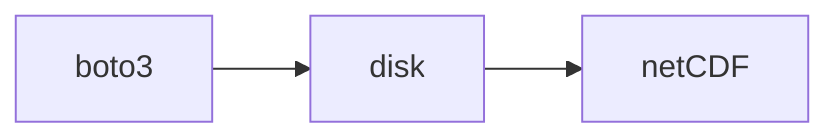

I'm writing this post (and any subsequent parts)
as a tutorial for my previous self, the one who
wanted to work with weather radar data but had no
actual idea how, and who struggled to pull together
the various pieces of information on the internet into a coherent
picture of how data actually gets processed into final products.
I'm also going to use it as an opportunity to explain my own work on
a practical processing pipeline for my own organization. This is
an expanded version of a conference talk I gave with some extension to other
topics, since I've got more than 20 minutes to discuss everything.

I'm going to start with the very basics: what I mean when I talk about weather radar,
the appeal of working with it, and the challenges. The goal is to build
a common understanding so that it's less overwhelming to crack open a Nexrad level II file and
understand how they are worked with in practice.

## Why Radar?

Weather radar is a _really_ useful tool if you're trying
to understand how much it rains in a certain area. Weather radar
lets you sample a 3-D cut of the atmosphere and understand how much
stuff is kicking around in it, at an absurdly high sampling rate. It effectively
gives you a window into what the atmosphere is doing for hundreds of square km every
5-8 minutes, with exceptional spatial resolution. This is a huge improvement over
the other common approach, which is to have a network of rain gauges across the area
you're trying to measure.

### Tipping Buckets

Rain gauges (the NOAA-approved and used ones anyway) use tipping buckets to measure
the volume of rain falling in a period. This approach gives you a highly accurate
estimate of precipitation for a _very_ specific point. Once you've got that estimate,
you have to make your own assumptions of how rainfall varies between those gauges.
If a rain event misses all the gauges in an area, you won't see it. In practice,
if you want to reasonably measure precipitation across a large area, you've got to
maintain multiple tipping bucket gauges. Since this is a direct, physical measurement,
these gauges are also subject to direct, physical interference. Part of my day job is
monitoring the data streams from these gauges, and they very frequently go out of
calibration or get things stuck in them, meaning that they don't respond to precipitation.
The only way to fix that is by sending someone out to clean and check it, which is a
time-consuming and fiddly process.

<a href="https://commons.wikimedia.org/wiki/File:Interior_tipping_bucket.JPG#/media/File:Interior_tipping_bucket.JPG">

### Radar

Weather radar towers are positioned at fixed intervals across the landscape
and scan the atmosphere in a circular pattern, listening to reflected EM
radiation in their preferred band to discern what is in the air around
the station. This isn't the only way that these systems can work; they are
sometimes put on moving platforms, may scan a cut of the sky from horizon to horizon,
or be mounted on an aircraft, for example. All of these different operating modes
introduce more complexity into identifying what you're actually working with
and how relevant different techniques are to your specific application; for our
purposes we're talking about fixed, atmospheric monitoring radar systems,
and in particular the WSR-88D (NEXRAD) system, which is a lot simpler
in terms of operating mode. Just know that this complexity bleeds into the
tools that we use to process weather radar and introduce complexity there as well. Because they use EM radiation to observe
the atmosphere, doppler weather radars can provide a granular estimate
of precipitation (and precipitation type) across wide areas with great 3D resolution.
It's also really fast; a 5-8 minute scan of the air from a WSR-88D platform can
generate 18 scans of the atmosphere, with millions of observations per scan. The cost
to this precision is added complexity; it is really pretty complicated to go from a raw
radar return to a useful precipitation estimate, or even an identification of
what is falling through the air in a given location. But that is the very basic
idea of how radar works. There are a large number of exceptional
educational materials online you can refer to if you want a better understanding
of the principles of radar observation, which I will not badly paraphrase here.

<p><a href="https://commons.wikimedia.org/wiki/File:NEXRAD_and_thunderstorm_in_New_Underwood,_South_Dakota,_2004_-_NOAA_Photo_Library_Wea01195.jpg#/media/File:NEXRAD_and_thunderstorm_in_New_Underwood,_South_Dakota,_2004_-_NOAA_Photo_Library_Wea01195.jpg"></a></p>

## Accessing Radar

Now that we've described some basics of the system,
we can start getting our hands dirty and work with actual
radar files. NOAA provides multiple processing levels of NEXRAD data
for public consumption. I typically work with nexrad level II, which
has had some processing applied but does not include derived quantities
that level 3 has; this is a tradeoff I made for my desired use characteristics;
the level 3 data is downsampled to a lower resolution grid and has lower
time resolution, so even though it's convenient (especially in a post-hoc sense)
it doesn't quite cut the mustard for me for spatiotemporal resolution in
my day job.

### Nexrad Level II

The nexrad level II dataset
is [hosted on AWS](https://registry.opendata.aws/noaa-nexrad/) (and GCP).
You can download the files there without authentication
for free; If you only care about looking at one or two
at a time, you can even browse the files and just download them
manually. I wrote up a little CLI to download a batch quickly
with multiple threads in rust, but a good middle of the road
automated way is using `boto3` in python. Here's an example script
which illustrates the basic steps of doing so:

```python
import boto3 
import botocore
from botocore.client import Config

s3 = boto3.resource("s3", config=Config(signature_version = botocore.UNSIGNED, user_agent_extra="Resource"))
bucket = s3.Bucket("unidata-nexrad-level2")
object_list = [ob for ob in bucket.objects.filter("YYYY/mm/dd/<radar_name>") if not ob.key.endswith("_MDM")]

for ob in object_list:
  bucket.download_file(ob.key, "OUTPUT_FILEPATH")

```

Some things to note:

- The directory structure in AWS is Year / Month / Day / radar_name
- Some keys in a day have ancillary information (the MDM files); we filter these out in this solution.
- All radar names are four-letter identifiers.
  - NEXRAD stations start with 'K'. My local station is KMKX, for example.
  - Terminal doppler radar stations start with 'T' and are associated with airports. My local terminal station is TMKE.

Your job isn't done once you have the file, however. Level II nexrad files
are compressed in an application-specific binary format. Decoding it depends on what
you're planning to do with it. If you want to stick to python, you can use
[`xradar`](https://docs.openradarscience.org/projects/xradar/en/stable/) or [`pyART`](https://arm-doe.github.io/pyart/), both of which are on conda and pypi. `xradar` is
the ingestion layer for [`ωradlib`](https://docs.wradlib.org/en/latest/), which has a bunch of tools I use since
they integrate with more standard netCDF tooling. In production I use
[`LROSE`](http://lrose.net) command line tools, since these are very fast (written in `C++`) and
have conveniences for converting and preprocessing at the same time, allowing me
to skip some pretty tedious coordinate work in xarray. This doesn't matter as much
if you're just doing visualization or working with a few files, but I suggest for
production installing a version of `LROSE` and using `RadxConvert`.

Using `RadxConvert` is pretty straightforward; the config file for it is
well-documented and the basic command line usage (not the streaming features)
is not too bad; the hardest thing is installing it outside of a supported platform.
I learned that `LROSE` is probably not a great candidate for
baby's first nix derivation, although I can't imagine it's genuinely that hard,
just that is is if you don't understand nix that well, much like yours truly.

For me, the command line call looks like:

```bash
RadxConvert -f <path_to_radarfiles>/* -params <path_to_params>/RadxConvert.params
```

which takes care of handling all the files in the specified path; the output
is specified in the params file along with a bunch of other stuff. The output
format for my files is `netCDF`, since this is basically the lingua franca for
all the other python libraries I use until I get to the storage and
output layer (I'll talk about that later).

So at this point, the pipeline looks like:



### Opening in Python

We're finally just about ready to open a file in python; we'll do so using [`xarray`](https://docs.xarray.dev/en/stable/)
and aforementioned `xradar`.
