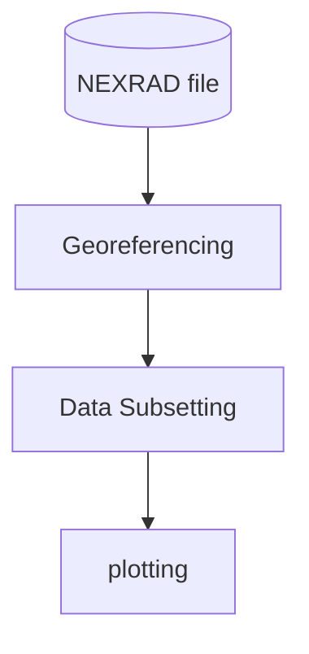

## The Beginning

Visualizing radar data is complicated, but it's a lot of fun and can get
you pretty far towards understanding weather patterns occurring near you.
Unless you're trying to pretend you're a hydrologist, like yours truly,
this is likely the most bang for your buck in terms of working with
radar data, as this is the part that most people really actually enjoy
seeing and hearing about. There are a couple of strategies I've used
to visualize radar data over time, all of them python-based but
varying based on the resources available to me and the amount of
understanding I have about the underlying format. This is the first subject
area I paid attention to with weather radar because it also helped
me get my head around the data structures, although it's not without
its challenges, including the inverse geodesy problem I discussed in my last post.

### Libraries

The primary plotting stack I use is `hvplot`; If you haven't
checked it out and are in the business of python visualization
then I strongly suggest you do. The project and its
related components are still very much in the works, but
the strategy of annotating data to achieve visualization outcomes
feels very natural and satisfying. There have been some great strides
even in the time I've been working with this ecosystem
towards more flexible and robust plotting in this ecosystem.

To be a little more concrete, when I plot radar data in a PPI (plan position indicator),
i.e. a top-down / "flat" view, I use `geoviews`, the geographic extension to `holoviews`
(upon which `hvplot` is based) and in particular its `xarray` extension, with
some additional processing I'll go into.

## The Processing Framework

The processing framework for visualizing moments looks something like this:

Which isn't too bad as a conceptual set.
I'm going to ellide the loading steps for this
in favor of the description I've previously given to that
step.
